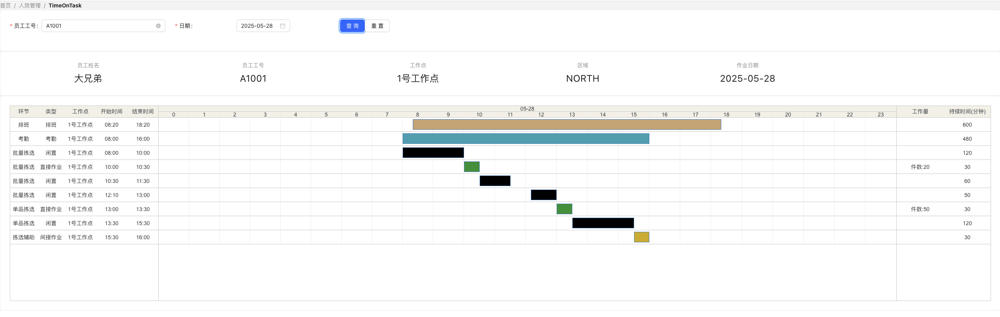
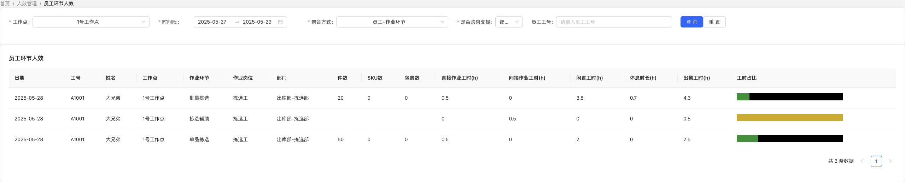
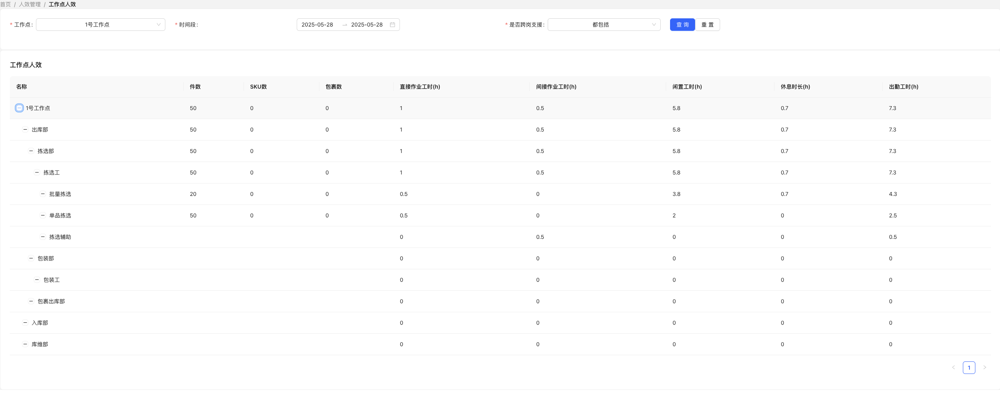

# Wagner
**劳动密集型人效计算引擎**

**Wagner源于头部互联网企业物流系统实战经验的人效计算引擎，通过解析排班/考勤/作业数据，实时/定时生成环节级直接工时、间接工时、闲置工时及环节人效，为制造业、物流等劳动密集型企业提供精益化管理和绩效激励的数据基座。**

----------

## Wagner提供了什么？
1. 极简的员工模型，可适配各类HCM人员模型
2. 灵活的员工动作模型，包含排班、考勤、直接作业、间接作业四种类型
3. 只需做数据层面的对接，基于原始作业数据，直接计算得到环节人效数据
4. 基于人+天的单人人效计算入口
5. 基于工作点+天的批量人效计算入口（待完善）
6. 工作点的部门/岗位/环节管理功能（待完善）
7. 多维度环节人效管理
   a. TimeOnTask
   b. 员工环节人效
   c. 工作点环节人效
   d. 员工实时状态
----------

## 快速开始
### 1.确保已安装Go环境
首先需要确保已经正确安装了Go，并设置了环境变量（GOPATH、GOROOT等）。可以通过以下命令检查：

```shell
go version
```

### 2.进入项目目录
假设你的项目位于/path/to/your/project，使用终端进入该目录：

```shell
cd /path/to/your/project
```

### 3.安装项目依赖
如果你的项目使用了第三方库，你需要先下载依赖。在项目根目录下运行：

```shell
go mod tidy
```

这条命令会根据你的go.mod文件下载所有依赖项。

### 4.构建项目
由于main.go在/cmd/api下，所以需要指定相对路径

```shell
 go build -o wagner ./cmd/api
```

这将在当前目录下生成一个名为 wagner（在Windows下是`wagner.exe`）的可执行文件。

### 5.初始化mysql数据库
依次执行

1. db_mysql.sql 初始化表结构
2. init_data.sql 初始化基础数据
3. demo.sql 初始化人员测试场景

### 6.运行项目
```shell
# Linux/Mac
./wagner

# Windows
wager.exe
```

----------

## 多维度环节人效管理
### TimeOnTask
[http://localhost:8080/web/timeOnTask](http://localhost:8080/web/timeOnTask)




## 员工环节人效
[http://localhost:8080/web/employeeEfficiency](http://localhost:8080/web/employeeEfficiency)




## 工作点环节人效
[http://localhost:8080/web/workplaceEfficiency](http://localhost:8080/web/workplaceEfficiency)



## 员工实时状态
[http://localhost:8080/web/employeeStatus](http://localhost:8080/web/employeeStatus)

----------
## 前端工程
https://github.com/supbro-dev/Wagner-front/

