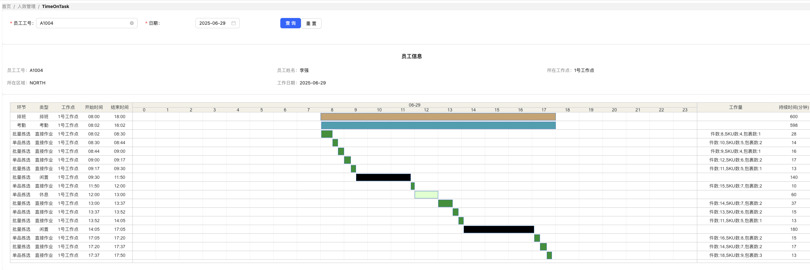

# Wagner
**劳动密集型人效计算引擎**

**Wagner源于头部互联网企业物流系统实战经验的人效计算引擎，通过解析排班/考勤/作业数据，实时/定时生成环节级直接工时、间接工时、闲置工时及环节人效，为制造业、物流等劳动密集型企业提供精益化管理和绩效激励的数据基座。**

----------

## Wagner提供了什么？
1. 极简的员工模型，可适配各类HCM人员模型
2. 灵活的员工动作模型，包含排班、考勤、直接作业、间接作业四种类型
3. 只需做数据层面的对接，基于原始作业数据，直接计算得到环节人效数据
4. 基于人+天的单人人效计算入口
5. 基于工作点+天的批量人效计算入口（待完善）
6. 工作点的部门/岗位/环节管理功能（待完善）
7. 多维度环节人效管理
   a. TimeOnTask
   b. 员工环节人效
   c. 工作点环节人效
   d. 员工实时状态（待完善）
----------

## 快速开始
待完善

----------

## 多维度环节人效管理
TimeOnTask

员工环节人效

工作点环节人效

员工实时状态
待完善

## 前端工程
https://github.com/supbro-dev/Wagner-front/
